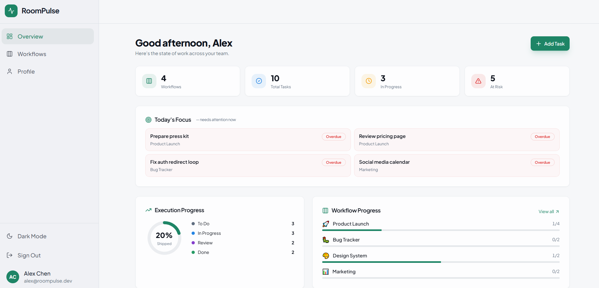
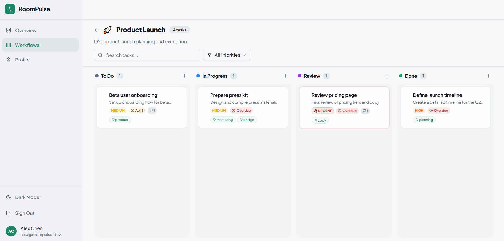
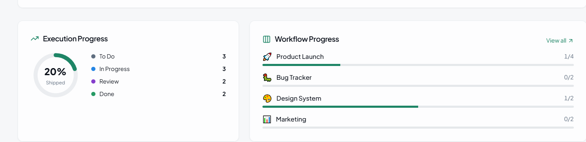

# RoomPulse

RoomPulse is a workflow execution platform built around visibility: blockers, priorities, active work, and delivery progress.

The project was designed to feel faster, clearer, and more focused than a generic task dashboard.

## Overview

RoomPulse started from a simple product idea: teams do better work when the interface makes execution visible.

That means the product is not just about storing tasks.  
It is about helping users understand:
- what is moving
- what is blocked
- what is overdue
- what needs attention now
- where work is slipping

That gives the app a more active and operational feel than a standard project board.

## Core Features

- Track work through a structured workflow interface
- Surface priorities, blockers, and active delivery state
- Use a more execution-focused dashboard instead of a passive summary page
- Review workflow information through a cleaner, more product-oriented UI
- Explore an interface designed to feel fast, focused, and operational
- Use the product on desktop and mobile without losing clarity

## Product Focus

RoomPulse is centered on execution.

The project was shaped around the idea that a workflow tool should not just look organized — it should make work easier to read.

That led to a stronger focus on:
- priorities
- due work
- visibility of blocked tasks
- ownership and activity
- cleaner dashboard structure
- faster internal product rhythm

## Why it stands out

RoomPulse is stronger than a generic productivity clone because it leans harder into product clarity.

Instead of relying on visual polish alone, it tries to build a clearer internal workflow tool through:
- denser operational context
- cleaner execution states
- stronger dashboard signals
- a more active, less passive product feel

That makes it feel more like a real workflow product and less like a basic task board demo.

## Design Direction

One of the goals of RoomPulse was to avoid the safe, repetitive modern SaaS template feeling.

The product uses a sharper workflow identity and a more focused internal-tool tone so it does not read like a second version of a business dashboard.

## Mobile Experience

RoomPulse was also shaped with mobile responsiveness in mind:
- task and workflow information remains readable
- dashboard sections stay usable
- spacing holds together on smaller screens
- the product keeps its structure without becoming crowded

## What this project was meant to prove

With RoomPulse, the goal was to show:
- stronger product thinking in a workflow context
- better clarity in internal tools
- a more distinctive execution-focused app
- portfolio work that feels intentional rather than generic

## Screenshots

## Screenshots

### Dashboard Overview

### Workflow Board

### Analytics & Progress

## Live Demo

**Live:**   https://roompulse.lovable.app/

**Repository:** https://github.com/lazarbukejlovic-dotcom/roompulse

## Author

**Lazar Bukejlovic**
